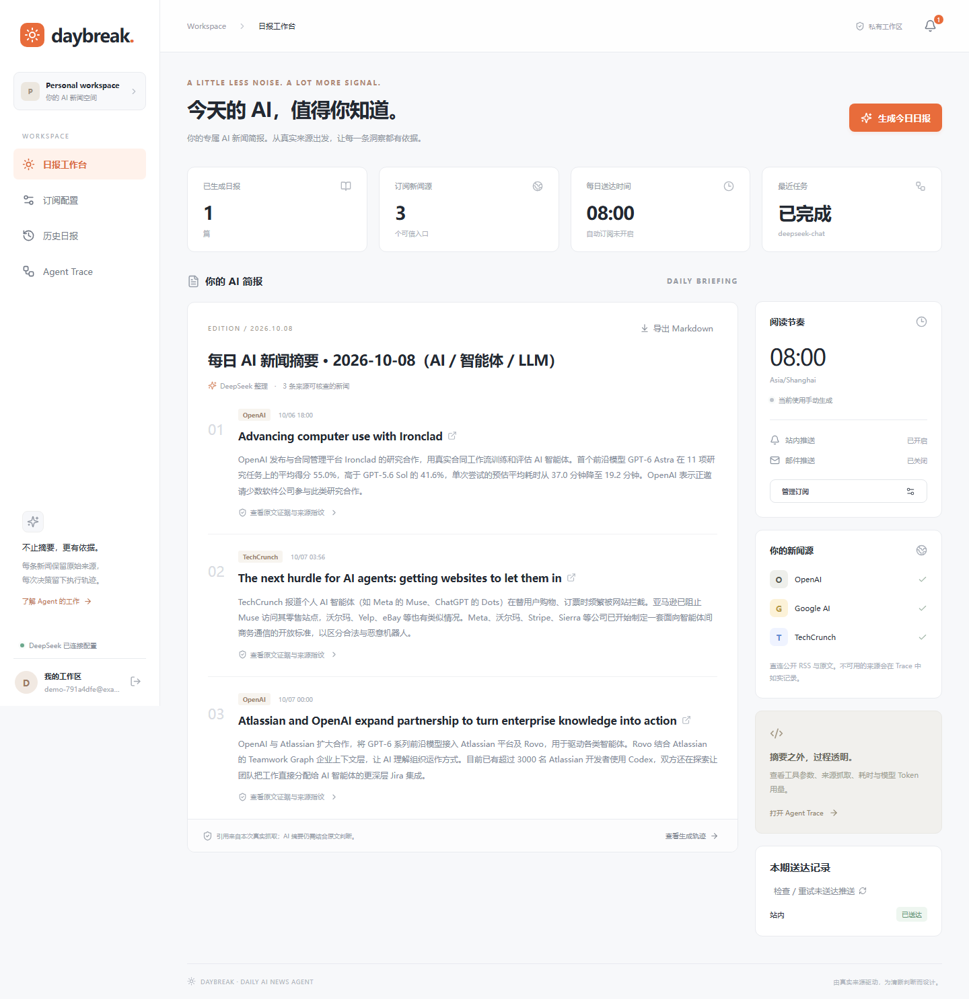
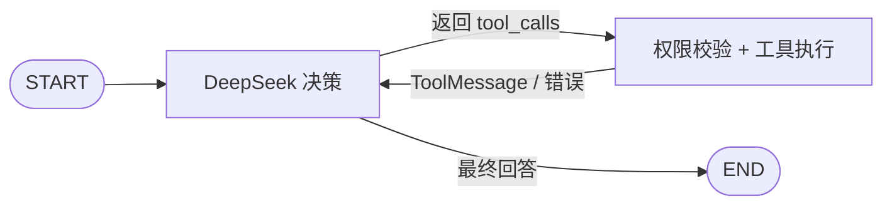

# Daily AI News Agent · Daybreak

基于 LangGraph 与 DeepSeek 的自主 AI 新闻 Agent：**由 LLM 选择工具调用顺序**，检索真实新闻、核验来源、生成日报，并提供订阅、定时任务、邮件/站内推送及 Agent Trace。面向 Agent / Vibe Coding 技术笔试的完整交付项目。

GitHub 仓库：**[chen0206a/daily-ai-news-agent](https://github.com/chen0206a/daily-ai-news-agent)**

技术栈：Python 3.11+（本机验证 3.13）、LangGraph、DeepSeek、FastAPI、SQLite WAL、Next.js 16、React 19、TypeScript。

## 项目能力与真实验收

- **真实 Agent Loop**：`model ↔ tools` 条件循环，模型自主选择搜索、抓取、笔记、保存与推送；工具错误回到模型供其决策。
- **10 个真实工具**：5 个工作区/命令工具 + 5 个新闻/订阅/日报业务工具，身份与权限由服务端绑定。
- **可核查新闻日报**：公开 RSS 与文章原文抓取、逐字证据、发布时间、抓取时间和 SHA-256，原文链接由服务端生成。
- **完整使用流程**：登录、订阅、历史日报、定时任务、持久化发件箱、站内通知、SMTP 邮件与实际调用 Trace。

以下为已保存的真实验收结果，详情见 [验收记录](evidence/validation.md)。此次 GitHub 发布仅整理和检查交付文件，没有手动重跑这些本机验收或调用真实模型；自动 GitHub Actions 的运行范围见下文。

| 验收项目 | 已记录结果 | 可公开证据 |
|---|---|---|
| 后端工具、安全、API、Agent 与推送测试 | **56 项通过** | [JUnit 报告](evidence/backend-tests.xml) |
| 浏览器端到端验收 | **2 项通过** | [Playwright 报告](evidence/browser-tests.json) |
| 真实 DeepSeek 端到端运行 | **7 轮模型调用、11 次工具执行** | [脱敏 Trace](evidence/live-e2e.json) |
| 真实生成与站内推送 | **3 条可核查新闻、1 条站内通知** | [真实日报](evidence/verified-digest.md) |
| 前端、依赖与邮件协议 | 生产构建通过；SMTP 本机 TCP 测试通过 | [验证范围与限制](evidence/validation.md) |

模型配置为 `deepseek-chat`，上述实际 API 响应模型名为 `deepseek-flash`。离线测试中的脚本模型仅用于协议测试，真实演示使用 DeepSeek API。GitHub Actions 不配置密钥、不调用真实模型；新检出的仓库缺少私有演示账号时，依赖该账号的浏览器场景会明确跳过。

下面为真实验收截图，仅包含演示账号的匿名标识和公开新闻内容：



## 获取项目

```bash
git clone https://github.com/chen0206a/daily-ai-news-agent.git
cd daily-ai-news-agent
```

## 快速启动（Windows）

需要 Python、Node.js 20.9+、Git for Windows（其 GNU 工具用于安全 bash 工具）。在项目根目录：

```powershell
powershell -ExecutionPolicy Bypass -File scripts/setup.ps1
# 编辑 .env，填写 DEEPSEEK_API_KEY；不要把它提交到 Git
powershell -ExecutionPolicy Bypass -File scripts/start.ps1
```

打开 <http://localhost:3000> 创建账户。API 文档：<http://127.0.0.1:8000/docs>。停止：`powershell -ExecutionPolicy Bypass -File scripts/stop.ps1`。日志在 `data/`。

也可分别运行两个终端，便于调试：

```powershell
# 终端 1：项目根目录
.\.venv\Scripts\python.exe -m uvicorn app.api:app --host 127.0.0.1 --port 8000 --workers 1
# 终端 2：frontend 目录
npm run dev
```

`.env.example` 是配置模板；真实 `.env` 被忽略。当前进程环境变量优先于 `.env`。`DEEPSEEK_MODEL` 默认 `deepseek-chat`；供应商可能将别名映射到具体模型，Trace 保留响应中的实际模型名。

## macOS / Linux 与容器

```bash
sh scripts/setup.sh
# 编辑 .env 后，两个终端分别执行：
.venv/bin/python -m uvicorn app.api:app --host 127.0.0.1 --port 8000 --workers 1
cd frontend && npm run start
```

Linux 需要 coreutils 提供 pwd/ls/cat/head/wc。Docker 配置提供非 root 服务与持久化数据卷：

```bash
cp .env.example .env  # 填好配置
docker compose up --build
```

**本次验证环境没有 Docker，可用性以 Python + Node 本机运行结果为准；容器配置尚未实际启动验证。** SQLite 使用单 worker，不能增加 `--workers`。数据默认位于 `data/news.sqlite3`，每用户工作区位于 `data/workspaces/<user_id>`。

## 操作流程

1. 创建账户并登录，在“订阅配置”选择主题、来源、语言、条数与时间窗口。
2. 点击“生成今日日报”，进入 Agent Trace；工具顺序由 DeepSeek 决定，页面每 3 秒获取新增执行状态。
3. 在日报页展开证据，核查原文链接、发布时间、抓取时间、SHA-256；可导出 Markdown。
4. 在历史日报回看归档，通知图标显示站内送达结果。
5. 开启自动生成后，服务按 IANA 时区每天检查到点任务。服务重启补当天已到点任务，`user_id + schedule:date` 防止重复调度。

每用户每天最多一份正式日报，重复生成会返回已有日报对应任务；生成失败且未保存日报时可以重新尝试。并发请求只能创建一个活跃运行。若日报已保存但推送尚未入队，使用 `POST /api/digests/{id}/send` 进行恢复。

邮件默认关闭。配置 `SMTP_HOST/PORT/FROM/USER/PASSWORD` 并在订阅中启用邮件。默认 STARTTLS/587；不支持隐式 TLS/465，需使用支持 STARTTLS 的邮件服务。收件地址固定为当前账户邮箱，Agent 无权改写。没有 SMTP 配置会显示 failed；提交后确认不明为 uncertain，不自动重发。

## 真正的 Agent Loop



核心代码在 [`backend/app/agent/graph.py`](backend/app/agent/graph.py)。使用 `StateGraph` 和条件边，`tool_choice="auto"`。没有固定的搜索→抓取→保存节点顺序。系统提示给出目标，工具层强制执行业务权限与来源约束。工具失败作为结构化结果返回模型，模型自主选择恢复方式。

模型能调用以下 **10 个真实工具**：

| 工具 | 实际能力与边界 |
|---|---|
| `list_dir` | 列出用户工作区目录，限制返回量 |
| `read_file` | 读取工作区 UTF-8 文件，限制大小 |
| `search_content` | 递归搜索字面文本并返回行号，跳过不安全路径 |
| `write_file` | 写入 md/txt/json/csv，限制文件/目录数量与总空间 |
| `bash` | 用真实系统进程执行 pwd/ls/cat/head/wc；argv + shell=False，不开放通用 shell |
| `search_news` | 联网获取订阅 RSS，按关键词相关度和发布时间排序，无搜索服务 Key 依赖 |
| `fetch_article` | 抓取本轮发现的允许域名文章，清理 HTML、隔离可疑注入、保存哈希 |
| `get_preferences` | 返回服务器绑定的用户偏好快照，不接受 user_id |
| `save_digest` | 验证文章归属、真实抓取与逐字引用，构造来源链接并幂等入库 |
| `send_digest` | 仅将当前用户/当前运行的日报入队到已配置渠道，唯一键去重 |

新闻源：OpenAI News、Hugging Face Blog、Google AI、TechCrunch AI。`search_news` 是对这些真实 RSS 的检索与排名，**不是全网搜索引擎**。个别站点连接超时、403 或页面结构变化会保留真实错误，不会用编造新闻补齐。

## 验证与真实演示

```powershell
# 离线工具、安全、API、Agent 图、调度与本机 SMTP 集成测试
.\.venv\Scripts\python.exe -m pytest backend/tests -q --junitxml=evidence/backend-tests.xml
.\.venv\Scripts\python.exe -m ruff check backend scripts

# 真正联网抓取，不调用模型
.\.venv\Scripts\python.exe scripts/check_news.py

# 真实模型 E2E：会消耗 DeepSeek API 额度；创建独立演示用户；只做站内推送
.\.venv\Scripts\python.exe scripts/live_e2e.py

# 在前后端服务启动后验证 UI
cd frontend
npx playwright install chromium
npm run build
npm run test:e2e
```

真实 E2E 通过实际 API 注册、保存偏好、提交运行，执行真实 DeepSeek + LangGraph，验证数据库日报与站内通知。临时演示登录信息保存在 **Git 忽略的** `evidence/private/demo-login.json`；提交包不带该账户数据库或密码。评审者可自己运行脚本生成账户。

离线 `ScriptedModel` 仅用来确定性测试不同调用顺序和错误恢复；运行时与真实 E2E 不使用它。真实测试失败时脚本返回非零退出码并记录失败，不回退为假结果。

交付证据（私有登录文件、数据库、密钥及测试运行产物不随仓库发布）：

- [验收结果与限制](evidence/validation.md)
- [实际模型调用记录](evidence/live-e2e.json) / [可核查新闻日报](evidence/verified-digest.md)
- [实际 RSS 与文章抓取](evidence/live-news.json)
- [后端 JUnit 报告](evidence/backend-tests.xml) / [浏览器报告](evidence/browser-tests.json)
- [Agent Trace 截图](evidence/agent-trace.png)

## 目录

```text
backend/app/          FastAPI、SQLite、安全、10 个工具、Agent、业务服务
backend/tests/        工具/安全/API/Agent/调度/SMTP 自动化测试
frontend/app/         登录、订阅、日报、归档、Trace、通知
frontend/tests/       Playwright 浏览器测试
scripts/             安装启动、真实新闻与真实模型 E2E
docs/                架构图、Workflow、安全、验收映射、3 分钟演示
evidence/            本次真实验证结果（私有内容不提交）
```

## API 速览

| 方法 / 路径 | 作用 |
|---|---|
| POST `/api/auth/register`, `/login`, `/logout` | 账户和会话（完整前缀均为 `/api/auth`） |
| GET `/api/me`, `/api/health`, `/api/sources` | 身份、运行配置状态、来源 |
| GET/PUT `/api/preferences` | 订阅配置 |
| POST/GET `/api/runs` | 提交任务、列出本人任务；支持 Idempotency-Key |
| GET `/api/runs/{id}`、`/{id}/trace?after=0` | 状态和审计事件（完整前缀 `/api/runs`） |
| GET `/api/digests?limit=30&offset=0`、`/{id}` | 日报列表和详情 |
| POST `/api/digests/{id}/send` | 当前渠道入队/显式重试提交前失败 |
| GET `/api/notifications`，POST `/{id}/read` | 站内通知（完整前缀 `/api/notifications`） |

修改请求要求 `X-Requested-With: daily-ai-news`；浏览器 Origin 必须等于 `FRONTEND_ORIGIN`。前端通过 Next.js 同源代理传递 HttpOnly Cookie。API 不开放任意工具执行端点。

## 设计、边界与参考

[完整架构图](docs/architecture.md) · [Workflow 图](docs/workflow.md) · [安全说明](docs/security.md) · [验收映射](docs/acceptance.md) · [3 分钟演示脚本](docs/demo-script.md)

[GitHub 交付说明](docs/github-delivery.md)记录发布范围、敏感内容审查、验收证据边界与后续复现步骤。

两张图提供 Markdown 中的 Mermaid 源码以及同名 SVG/PNG。重新导出：在 `frontend` 执行 `node ../scripts/render_diagrams.mjs`（需要已安装 Playwright Chromium）。提交打包：`git add .` 后运行 `python scripts/package_submission.py`，只包含 Git 索引中的文件并检查当前配置密钥，输出到 `dist/`。

引用检查证明来源与证据存在，不保证模型摘要没有语义误差。Prompt Injection 防御采用多层约束，不声称可以完全识别所有攻击。SMTP 不可能凭本地数据库实现端到端 exactly-once。本项目没有邮箱所有权验证/密码找回，公开部署需接入成熟身份服务与生产安全配置。具体威胁边界和恢复操作见安全说明。

实现参考官方资料：[LangGraph 条件工具路由](https://reference.langchain.com/python/langgraph.prebuilt/tool_node/tools_condition)、[DeepSeek Tool Calls](https://api-docs.deepseek.com/guides/tool_calls/)、[Next.js 安装与构建](https://nextjs.org/docs/app/getting-started/installation)。
