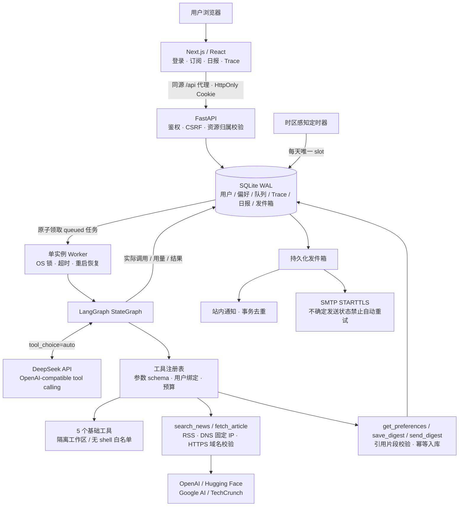

# 架构图

下面保留可编辑 Mermaid 源码；另有同名 PNG 导出。

所有工具的 user_id、run_id、工作区和收件邮箱由后端绑定；模型 schema 不含这些可越权参数。模型看到的是工具能力描述，API 从不接受直接执行任意工具的请求。

本项目针对单机笔试交付，数据库与任务队列共用 SQLite，运行一个 API worker。OS 文件锁防止多个调度器争抢重启恢复逻辑；不依赖内存中的任务列表保存进度。SQLite 保存完整执行审计，但不保存可跨版本恢复的 LangGraph checkpoint；进程中断的运行标记为 interrupted，排队任务可继续处理。

多实例部署需将任务队列/租约与数据库迁移到独立服务，而不是简单增加 uvicorn workers。
