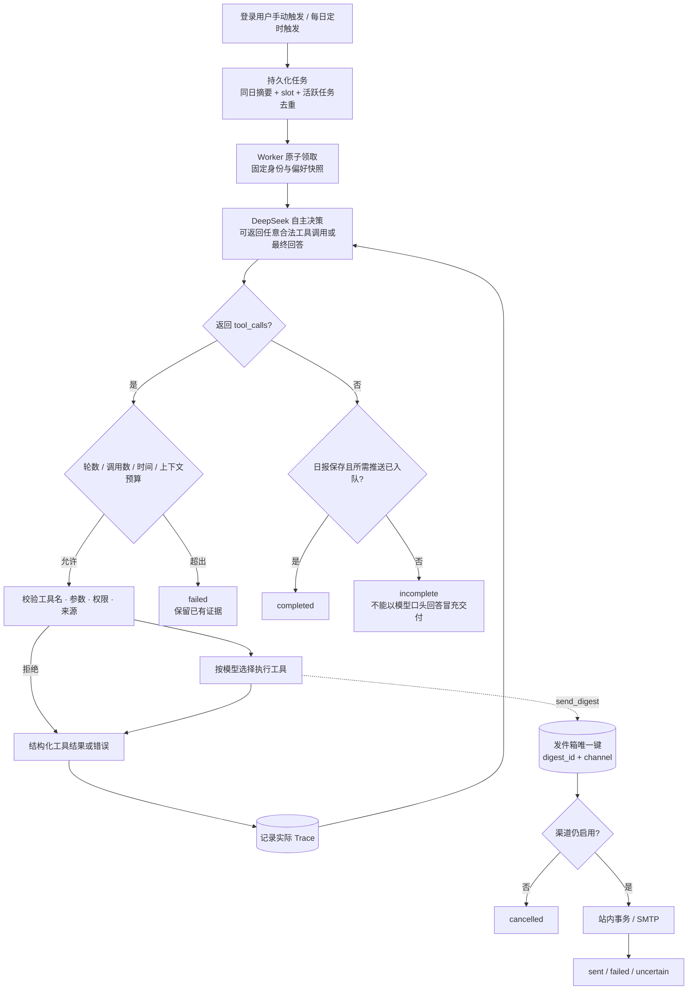

# Workflow：由模型控制的循环

下面保留可编辑 Mermaid 源码；另有同名 PNG 导出。

## 为什么不是固定流水线

`backend/app/agent/graph.py` 只定义 `model → tools → model` 与条件结束。没有 `search → fetch → summarize → send` 的硬编码边。模型可以先读偏好、列文件，也可以再次搜索、连续抓取、读取笔记、根据错误重新调用；多个工具调用也保留模型选择的顺序。

离线测试将两种工具顺序输入同一图，验证调用顺序确实变化；它只是协议测试替身。真实运行证据在 `evidence/live-e2e.json`，包含供应商 response_id、实际模型名、Token 用量和工具参数，不能由离线替身生成。

## 业务数据依赖并非写死流程

`fetch_article` 只允许本轮已发现的 URL；`save_digest` 只接受本轮已抓取文章的 ID 和逐字证据；`send_digest` 只允许本轮已经保存的日报。这些是授权和事实依据的前置条件，不替模型决定搜索词、文章选择、重试方式或调用顺序。
